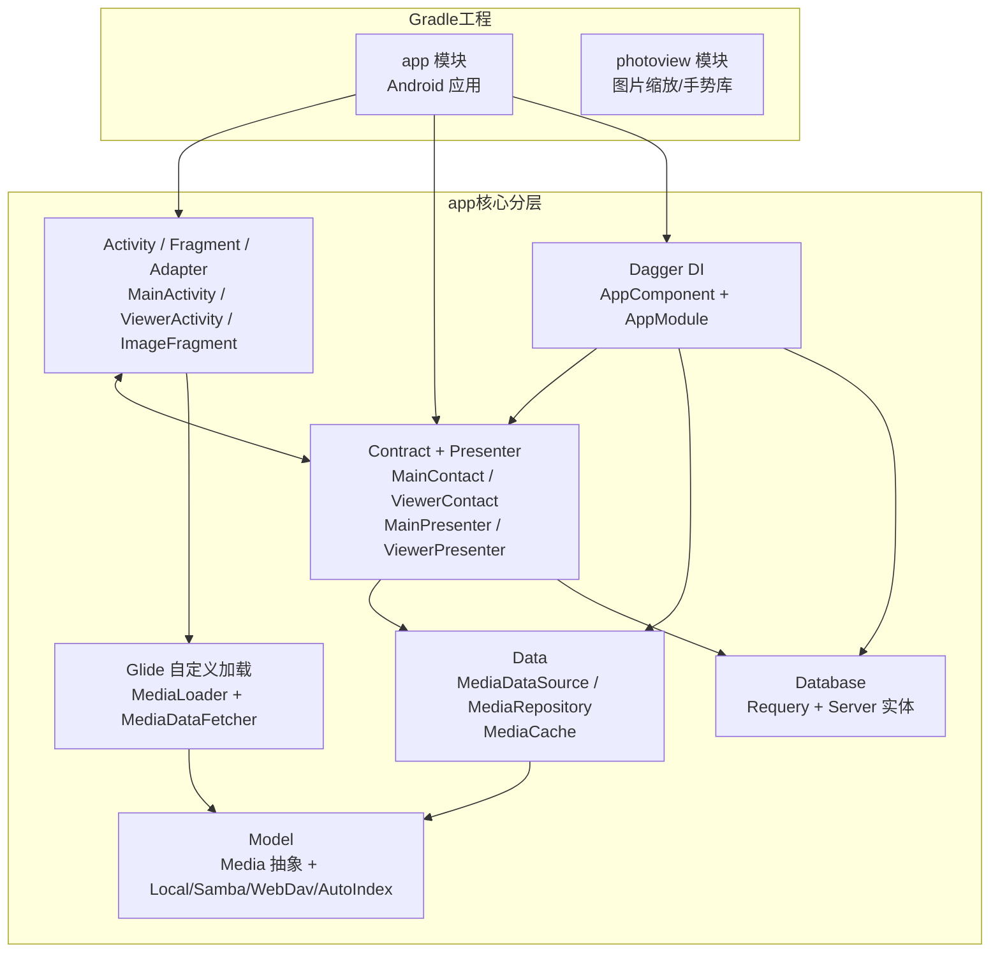
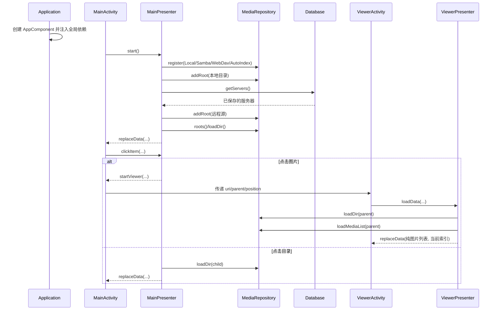
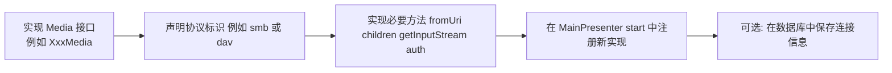

# Gallery 代码库速查图（新人向）

> 一张图 + 最短路径，快速理解：从主界面到数据层，再到多协议媒体实现。

## 1) 整体架构速查（模块 & 分层）

---

## 2) 主流程速查（从启动到看图）

---

## 3) 多协议扩展速查（新增一种来源怎么做）

---

## 4) 新人建议阅读顺序（30~60 分钟）

1. `app/src/main/AndroidManifest.xml`：先看页面入口与 Application。  
2. `activity/MainActivity.java` + `presenter/MainPresenter.java`：理解主列表和目录导航。  
3. `data/MediaDataSource.java` + `data/MediaRepository.java`：理解统一数据抽象。  
4. `model/Media.java` + `model/media/*Media.java`：理解多协议统一机制。  
5. `activity/ViewerActivity.java` + `presenter/ViewerPresenter.java` + `fragment/ImageFragment.java`：理解全屏查看链路。  
6. `di/*`：看依赖注入怎么把对象串起来。  
7. `glide/*`：理解为什么 Glide 能直接加载 `Media`。  

---

## 5) 常见排查点（实战高频）

- 看不到某个远程源：先查 `register()` 是否注册对应 scheme，再看 `addRoot()` 的 URI 格式。  
- 能进目录但无缩略图：查 `MediaDataFetcher` 是否拿到 `InputStream`，以及该目录是否有可识别图片后缀。  
- 查看器位置错乱：重点看 `ViewerPresenter` 里“文件列表索引”和“纯图片索引”的转换逻辑。  
- 返回键行为不符合预期：看 `MainPresenter.loadParent()` 与 `MainActivity.onBackPressed()` 联动。  

